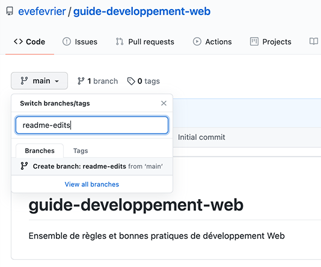
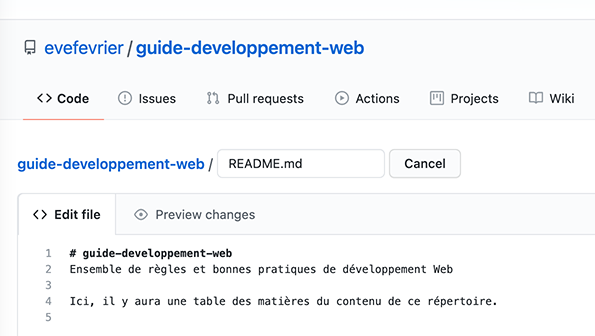
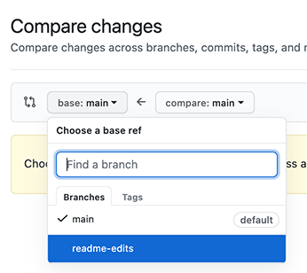
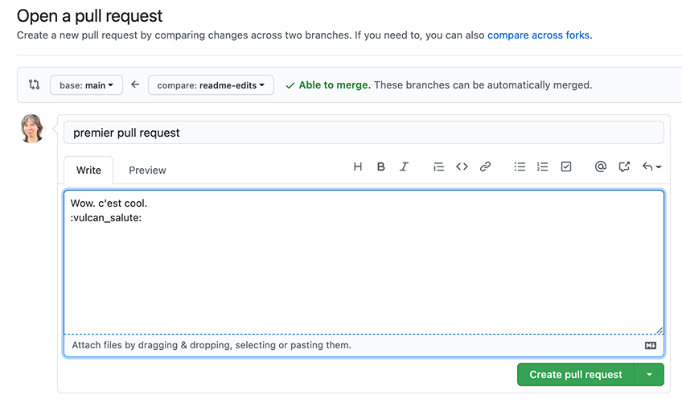
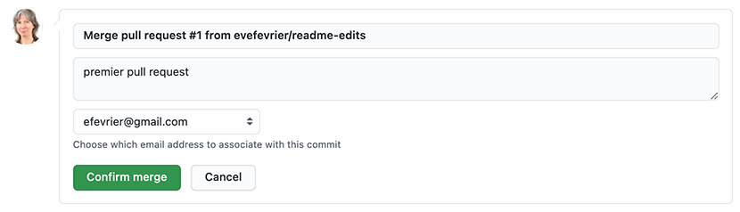
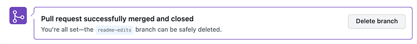

# Github 101 | Hello World

Le projet *Hello World* est une tradition séculaire en programmation informatique. 
Il s’agit d’un exercice simple qui vous permet de commencer à apprendre quelque chose de nouveau. Commençons par GitHub !

Vous apprendrez à :
- Créer et utiliser un répertoire (*repository* alias repo)
- Démarrer et gérer une nouvelle branche
- Apporter des modifications à un fichier et les pousser (push) à GitHub comme *commits*
- Ouvrir et fusionner(merge) un *pull request* 

## Qu’est-ce que GitHub?
GitHub est une plate-forme d’hébergement de code pour le contrôle de version et la collaboration. Il vous permet, ainsi qu’à d’autres, de travailler ensemble sur des projets de n’importe où.
Ce tutoriel vous enseigne par la pratique, les concepts de base de GitHub comme:
- les repositorys (__répertoires__), 
- les __branches__, 
- les __commits__ (sauvegardes ou instantanés), 
- et les __pull requests__ (demandes de contribution). 

Vous créerez votre propre répertoire Guide de développement Web 
et apprendrez le flux de travail avec demandes de contribution (*Pull Requests*) sur GitHub, 
un moyen populaire de créer et d’examiner du code.

## Aucun codage nécessaire
Pour compléter ce tutoriel, vous avez besoin d’un compte GitHub.com et d’un accès Internet. Vous n’avez pas besoin de savoir coder, utiliser la ligne de commande ou installer Git (le logiciel de contrôle de version sur lequel s’appuie GitHub).

> __Astuce__ : Ouvrir ce guide dans une fenêtre de navigateur séparée (ou onglet) afin que vous puissiez le voir pendant que vous remplissez les étapes du tutoriel.

 
## Étape 1. Créer un répertoire (*repository*)
Un répertoire est généralement utilisé pour organiser un seul projet. 
Les répertoires peuvent contenir des dossiers et des fichiers, des images, des vidéos et des ensembles de données – tout ce dont votre projet a besoin. 

Nous vous recommandons d’inclure un *README*, un fichier avec des informations sur votre projet. GitHub vous permet d’en ajouter un facilement en même temps que vous créez votre nouveau répertoire. Il offre également d’autres options fréquentes telles qu’un fichier de licence.

Votre répertoire peut être un endroit où vous stockez des idées, des ressources, ou même partager et discuter avec d’autres. 

### Pour créer un nouveau répertoire
•	Dans le coin supérieur droit, à côté de votre avatar ou identicon, cliquez __+__ et sélectionnez ensuite *__New repository__*.

•	Nommez votre répertoire : « guide-developpement-web »

•	Écrivez une courte description :
« Ensemble de règles et de bonnes pratiques de développement Web »

•	Sélectionnez *__Initialize this repository with a README__*  
Cochez cette case pour que le répertoire soit créé avec un fichier de documentation nommé *README.md*  
L’extension .md est une abbréviation d’un langage rudimentaire, le *MarkDown*  que l’on peut comparer à un HTML extrêmement simplifié comme on peut le découvrir ici : https://www.markdownguide.org/basic-syntax/ 

•	Cliquez *__Create repository__*

 
## Étape 2. Créer une branche
__Créer des branches est la façon de travailler sur différentes versions d’un répertoire à la fois.__

Par défaut, votre répertoire a une branche nommée *__main__* qui est considérée comme __la branche maîtresse (le tronc de l’arbre!)__. Nous utilisons d’autres branches pour expérimenter et faire des modifications avant de les fusionner à la branche maîtresse.

Lorsque vous créez une branche hors de la *__main__*, vous faites une copie, ou un instantané, de ce qu’elle était à ce moment-là.  
Il est utile de savoir que si quelqu’un d’autre a apporté des modifications à la branche *main* pendant que vous travailliez sur votre branche, vous pourrez toujours aller chercher ces mises à jour pour qu'elles s'incorporent à votre branche de travail en faisant un *__pull__*. 

Ce diagramme montre:
- La branche *__main__* (*master branch*)
- Une nouvelle branche appelée *feature* ou fonctionnalite 
(parce que nous élaborons une nouvelle « fonctionnalité » sur cette branche) 
- Les étapes d’élaboration de cette nouvelle fonctionnalité avant qu’elle ne soit fusionné à la branche *__main__*

Avez-vous déjà enregistré différentes versions d’un fichier ? 
Quelque chose comme:
- nom-de-fichier.txt
- nom-de-fichier-version-2.txt
- nom-de-fichier-version-finale.txt

Les branches accomplissent des objectifs similaires dans les dépôts GitHub.
Dans tous les cas, il faut s’efforcer d’avoir des noms assez significatifs pour que ce soit clair pour une autre personne ou nous-mêmes dans 3 ans…

Sur GitHub, développeurs, écrivains et concepteurs utilisent des branches pour garder les corrections de bogues et les fonctionnalités séparées de la branche main. 
Quand un changement est prêt, ils fusionnent leur branche à la branche maîtresse.

### Pour créer une nouvelle branche
1.	Allez à votre nouveau répertoire *guide-developpement-web*

2.	Cliquez sur le menu-déroulant qui dit *__branch: main__*.

3.	Tapez un nom de branche : *__readme-edits__* dans la nouvelle boîte de texte  

4.	Cliquez *__Create branch__* ou appuyez la touche « Entrez » sur votre clavier.

Maintenant, vous avez deux branches : *__main__* et *__readme-edits__*. 
Elles se ressemblent exactement, mais pas pour longtemps! Car nous ajouterons nos modifications à la nouvelle branche.

## Étape 3. Apporter et valider des modifications
Bravo! 
Maintenant, vous êtes sur la vue de code pour votre branche *readme-edits*, qui est une copie de *main*. 
Faisons quelques modifications.  
__Sur GitHub, les modifications enregistrées sont appelées *commits*.__  
Chaque commit a un message de validation associé, qui est une description expliquant pourquoi une modification particulière a été apportée. Les messages de validation capturent l’historique de vos modifications, afin que d’autres contributeurs puissent comprendre ce que vous avez fait et pourquoi.

Apporter et valider des modifications
1. Cliquez sur le fichier *__README.md__*

2. Cliquez sur l’icône crayon dans le coin supérieur droit.  

3. Dans l’éditeur, écrivez à la suite du titre et de la description :
 « Ici, il y aura une table des matières du contenu de ce répertoire »    

4. Un peu plus bas, dans la boîte *Commit Changes*, écrivez un message de validation qui décrit vos modifications : « Début de ce guide ». Pas besoin d’ajouter de description.

5. Cliquez sur Le bouton *__Commit changes__*.   

Ces modifications seront apportées seulement au fichier *__README.md__* sur votre branche *__readme-edits__*. Maintenant, cette branche contient du contenu différent de celui de la branche *__main__*.

## Étape 4. Ouvrir un Pull Request
Maintenant que vous avez fait des modifications dans une branche hors du main, vous pouvez ouvrir un *pull request*.

__Les *Pull Requests* sont au cœur de la collaboration sur GitHub.__

Lorsque vous ouvrez un *pull request*, vous proposez vos modifications et demandez à quelqu’un d’examiner votre code pour ensuite joindre votre contribution à la branche *__main__*. 

Les *Pull Requests* affichent des *diffs*, ou des différences, du contenu des deux branches. 
Les changements sont affichés en vert (les ajouts) et rouge (les suppressions).

Dès que vous faites un *commit*, vous pouvez ouvrir un *pull request*, et démarrer une discussion, avant même que le code soit terminé.

En utilisant le système de __@mention__ de GitHub dans votre message de *pull request*, vous pouvez demander des commentaires de personnes ou d’équipes spécifiques, qu’elles soient dans le couloir ou à 10 fuseaux horaires.

Vous pouvez même ouvrir des *pull request* dans votre propre répertoire et les fusionner vous-même. C’est une excellente façon d’apprendre le flux GitHub avant de travailler sur des projets plus importants.

### Ouvrir un Pull Request pour les modifications au README
__4.1__  
Cliquez sur l’onglet *Pull Request*, puis à partir de la page *Pull Request*, cliquez sur le bouton vert *__New pull request__*.  
  

__4.2__  
Dans la fenêtre Compare changes, selectionner *__base:main__* et *__compare:readme-edits__*.  
 

__4.3__  
Regardez vos modifications dans les *diffs* sur la page de comparaison, assurez-vous qu’elles sont ce que vous voulez soumettre.   
*Note : la capture-écran ci-dessous ne corresponds pas au résultat que vous obtiendrez. C’est un exemple différent pour montrer la coloration et les symboles identifiant une suppression et un ajout.*  
  
  
__4.4__  
Lorsque vous êtes convaincu que ce sont les modifications que vous souhaitez soumettre, cliquez sur le bouton *__Create pull request__*.  

 
__4.5__  
Dans la fenêtre *__Open a pull request__*, 
donnez un titre : « premier pull request » et rédigez une brève description de vos modifications :
« Ajout au ReadMe. Wow, c’est cool! »  

 
Lorsque vous avez terminé avec votre message, cliquez sur *__Create pull request__*!  
> __Astuce__: Vous pouvez utiliser des [emoji](https://github.com/ikatyang/emoji-cheat-sheet/blob/master/README.md) et glisser-déposer des images et des gifs sur les commentaires et les *pull requests*.  
Il est généralement possible de copier-coller ou glisser-déposer une image directement dans les boites de saisie de textes du navigateur.

:vulcan_salute:

## Étape 5. Fusionnez (*merge*) votre *pull request*
Dans cette dernière étape vous allez fusionner vos modifications de la branche *readme-edits* à la branche *main*. 
1. Cliquez sur le bouton vert *__Merge pull request__* pour fusionner les 2 branches.  

 
2. Cliquez sur *__Confirm merge__*.  

 
3. Maintenant, puisque les modifications de la branche *readme-edits* ont été incorporées à la *main*, nous pouvons supprimer la branche de travail *readme-edits* avec le bouton *__Delete branch__* dans la boîte violette.  

 
## Célébrer!
En complétant ce tutoriel, vous avez appris à créer un projet et faire un *pull request* sur GitHub!  
Voici ce que vous avez accompli dans ce tutoriel:
- Création d’un répertoire open source
- Démarrer et gérer une branche de travail
- Modification d’un fichier et commit de ces modifications à GitHub
- Ouverture d’un *pull request* et fusion(*merge*) de celui-ci à la branche maîtresse
Jetez un œil à votre profil GitHub et vous verrez vos nouveaux carrés de contribution!

### Documentation
Le processus de travail avec GIT : [Understanding the GitHub flow · GitHub Guides](https://guides.github.com/introduction/flow/)  
Autres guides et chaîne youtube officielle de Github : 
[GitHub Guides](https://guides.github.com/)  
[GitHub Training & Guides - YouTube](https://www.youtube.com/githubguides)   

### Crédits
Ce document est une traduction par Ève Février du tutoriel original : 
[Hello World · GitHub Guides](https://guides.github.com/activities/hello-world/)

