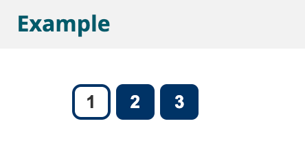

# Tutoriel Carrousel

- Structure
- Fonctionnalités
- Animation
- Styler le carrousel

## Structure

### Le bloc (structure générale)

En tant que collection d'éléments de contenu, les carrousels sont généralement mieux représentés sous forme de listes non ordonnées, en utilisant `<ul>` et `<li>`. Selon le contexte, d'autres éléments peuvent également être utilisés.

Chaque carrousel doit être enfermé dans une zone étiquetée, pour permettre aux utilisateurs de trouver facilement le carrousel. Dans l'exemple suivant, un élément `<section>` est utilisé pour définir la région et **aria-labelledby** définit l'en-tête qui contient l'étiquette.

```
<section class="carousel" aria-labelledby="carouselheading">
  <h3 id="carouselheading" class="visuallyhidden">Recent news</h3>
  <ul>
    <li class="slide">…</li>
    <li class="slide">…</li>
    <li class="slide">…</li>
    …
  </ul>
</section>
```

### Items du carrousel

Les carrousels sont souvent utilisés comme galerie pour afficher une série d'images. Cependant, des contenus plus complexes, tels que des teasers, des articles ou des sections entières de pages Web, peuvent également être affichés dans des carrousels. Dans tous les cas, utilisez un balisage approprié pour vous assurer que la structure et la signification du contenu sont transmises clairement. Un tel balisage peut inclure des titres, des sections, des listes, des articles et d'autres éléments selon les besoins.

Ce premier exemple montre un élément de carrousel avec des images comme contenu :

```
<li class="slide">
  
</li>
```

Cet exemple d'article comprenant un titre et un paragraphe montre comment un contenu plus complexe peut être utilisé.

```
<li class="slide" style="background-image: url('teddy1.jpg');">
  <article>
    <h4>Space Teddy production reaches all-time high</h4>
    <p>Teddies in Space Inc. has released outstanding numbers for the last solar year. The production of Space Teddies increased by 17%. The new version, scheduled to be released in a few months, will likely be the biggest Space Teddy release ever.</p>
    …
  </article>
</li>
```

## Fonctionnalités

Fournir une fonctionnalité pour sélectionner des éléments de carrousel et informer les utilisateurs du changement d'éléments de carrousel.

### Ajouter des boutons précédent et suivant

Fournissez des boutons pour permettre aux utilisateurs de basculer entre les éléments. Utilisez les éléments `<button>` pour fournir une signification sémantique, une prise en charge des technologies d'assistance et un comportement de clavier cohérent.

Créez et ajoutez les boutons à l'aide de JavaScript, car ils ne fonctionnent que lorsque JavaScript est disponible de toute façon.

```
var ctrls = document.createElement('ul');

ctrls.className = 'controls';
ctrls.innerHTML = '<li>' +
    '<button type="button" class="btn-prev">' +
      '' +
    '</button>' +
  '</li>' +
  '<li>' +
    '<button type="button" class="btn-next">' +
      '' +
    '</button>' +
  '</li>';

ctrls.querySelector('.btn-prev').addEventListener('click', function(){
  prevSlide(true);
});

ctrls.querySelector('.btn-next').addEventListener('click', function(){
  nextSlide(true);
});

carousel.appendChild(ctrls);
```

### Annoncer l'élément en cours

Utilisez une _WAI-ARIA live region_ pour informer les utilisateurs de lecteurs d'écran de l'élément actuellement affiché. Dans cet exemple, une région dynamique visuellement masquée et « polie » est utilisée et ajoutée au carrousel lorsque le carrousel est chargé. Ensuite, lorsque vous cliquez sur les boutons précédent ou suivant, le texte "Article x de y" (avec x pour le numéro d'article actuel et y pour le nombre d'articles) est défini sur cette région en direct. Les lecteurs d'écran compétents annonceront ce texte.

Autoriser l'utilisateur à garder le contrôle du focus du clavier. Lorsque le carrousel avance automatiquement, les utilisateurs ne doivent pas être éloignés de leur emplacement actuel dans la page. De plus, ne déplacez pas le focus du clavier lorsque les boutons précédent ou suivant sont utilisés ; déplacer le focus rend plus difficile pour les utilisateurs de naviguer entre les diapositives.

Vous trouverez plus d'informations sur WAI-ARIA dans la présentation WAI-ARIA, les pratiques de création WAI-ARIA et la spécification.

**Code: Add a live region to the carousel**

```
var liveregion = document.createElement('div');
liveregion.setAttribute('aria-live', 'polite');
liveregion.setAttribute('aria-atomic', 'true');
liveregion.setAttribute('class', 'liveregion visuallyhidden');
carousel.appendChild(liveregion);
```

**Code: Change text in the liveregion to have that text announced**

```
if (announceItem) {
  carousel.querySelector('.liveregion').textContent = 'Item ' + (new_current + 1) + ' of ' + slides.length;
}
```

### Ajouter des boutons de navigation

Afficher les boutons de chaque élément du carrousel et mettre en surbrillance l'élément actuel. Cela permet aux utilisateurs d'avoir un aperçu du contenu du carrousel, où ils se trouvent dans la séquence et leur permettra de naviguer directement vers n'importe quel élément.

La liste avec des boutons dans l'exemple ci-dessous est ajoutée à l'aide de JavaScript, avec un numéro sur le bouton qui correspond à l'élément du carrousel. Les boutons sont numérotés en fonction des éléments du carrousel correspondants. Le bouton de l'élément de carrousel actif est mis en surbrillance visuellement et à l'aide de texte masqué visuellement (pour les lecteurs d'écran).

Consultez la page de style du carrousel pour plus d'informations sur la façon de mettre en évidence l'élément de carrousel actif de manière accessible.

```
<ul class="slidenav">
  <li>
    <button class="current" data-slide="0">
      <span class="visuallyhidden">News</span> 1
      <span class="visuallyhidden">(Current Slide)</span>
    </button>
  </li>
  <li>
    <button data-slide="1">
      <span class="visuallyhidden">News</span> 2
    </button>
  </li>
  <li>
    <button data-slide="2">
      <span class="visuallyhidden">News</span> 3
    </button>
  </li>
</ul>
```



### Focus sur l'élément de carrousel sélectionné

Lorsque les utilisateurs sélectionnent un élément avec ces boutons de navigation, le focus doit être défini sur l'élément sélectionné. Dans ce cas, le focus doit être défini sur l'élément `<li>` dont la classe est actuellement définie, après le changement ou la transition. Cela facilite l'interaction pour les utilisateurs du clavier et des technologies d'assistance.

Par défaut, les éléments `<li>` ne peuvent pas recevoir le focus. En définissant son attribut tabindex sur -1, l'élément est activé pour recevoir le focus via JavaScript.

## Animation

Fournissez aux utilisateurs le contrôle des animations dans le carrousel.

**La mise en pause de l'animation est essentielle** pour les personnes qui trouvent le mouvement gênant ou qui ont besoin de plus de temps pour lire.

### Ajouter un bouton Lecture/Arrêt

Fournir un bouton pour permettre aux utilisateurs d'arrêter et de reprendre l'animation. L'exemple ci-dessous illustre comment un tel bouton peut être balisé. Le libellé du bouton et sa fonction changent selon que l'animation est en cours d'exécution ou non.

**Code: While animation is running**

```html
<button data-action="stop">
  <span class="visuallyhidden">Stop Animation </span> ￭
</button>
```

**Code: While animation is stopped**

```html
<button data-action="start">
  <span class="visuallyhidden">Start Animation </span> ▶
</button>
```

**Note**
Le JavaScript remplace uniquement la valeur de l'élément `<button>` et ses attributs. Remplacer tout le bouton entraînerait une perte de focus du clavier.

### Pause au survol de la souris et au clavier

Suspendez l'animation du carrousel lorsque le pointeur de la souris survole le carrousel ou lorsqu'il reçoit le focus du clavier. La pause au survol de la souris est utile pour les personnes qui ont besoin de plus de temps pour lire le contenu et facilite le clic sur les liens dans le carrousel. Les utilisateurs du clavier ne perdent pas leur position lorsque le carrousel est en pause.

**Code:**

```javascript
carousel.addEventListener("mouseenter", suspendAnimation);
carousel.addEventListener("mouseleave", startAnimation);

carousel.addEventListener("focusin", function (event) {
  if (!hasClass(event.target, "slide")) {
    suspendAnimation();
  }
});
carousel.addEventListener("focusout", function (event) {
  if (!hasClass(event.target, "slide")) {
    startAnimation();
  }
});
```

**Note**
Les événements focusin et focusout sont définis dans la spécification des événements de niveau 3 du modèle d'objet de document (DOM) du W3C (ébauche de travail) et implémentés dans de nombreux navigateurs. Firefox a besoin d'un polyfill court au moment de la publication de ce tutoriel.

### Masquer les éléments de transition des technologies d'assistance

Pendant les transitions, les éléments actuels et suivants sont visibles.

Cela signifie également que ces deux éléments sont disponibles pour les technologies d'assistance, l'élément actuel disparaissant, ce qui peut être déroutant pour les utilisateurs de lecteurs d'écran.

Dans l'exemple suivant, l'élément en cours d'activation obtient une classe `in-transition` qui le rend visible. L'attribut **aria-hidden** est défini sur true pour masquer l'élément aux technologies d'assistance. Une fois la transition terminée, l'attribut aria-hidden est supprimé.

**Code: JavaScript**

```javascript
slides[new_next].className =
  "next slide" + (transition == "next" ? " in-transition" : "");
slides[new_next].setAttribute("aria-hidden", "true");

slides[new_prev].className =
  "prev slide" + (transition == "prev" ? " in-transition" : "");
slides[new_prev].setAttribute("aria-hidden", "true");

slides[new_current].className = "current slide";
slides[new_current].removeAttribute("aria-hidden");
```

### Ressources WCAG connexes

Ces didacticiels fournissent des conseils sur les meilleures pratiques pour la mise en œuvre de l'accessibilité dans différentes situations. Cette page combinait les critères de réussite WCAG suivants et les techniques de différents niveaux de conformité :

#### Critères de succès:

[2.2.2 Pause, Stop, Hide](https://www.w3.org/WAI/WCAG21/quickref/#qr-time-limits-pause):

- Pour déplacer, clignoter, faire défiler ou mettre à jour automatiquement les informations, toutes les conditions suivantes sont vraies :
  - **Déplacement, clignotement, défilement** :  
    pour toute information en mouvement, clignotement ou défilement qui  
     (1) démarre automatiquement,  
     (2) dure plus de cinq secondes et  
     (3) est présentée en parallèle avec un autre contenu,  
     il existe un mécanisme permettant à l'utilisateur de mettez-le en pause, arrêtez-le ou masquez-le à moins que le mouvement, le clignotement ou le défilement ne fasse partie d'une activité où il est essentiel ; et
  - **Mise à jour automatique** :  
    pour toute information de mise à jour automatique qui  
     (1) démarre automatiquement et  
     (2) est présentée en parallèle avec d'autres contenus,  
     il existe un mécanisme permettant à l'utilisateur de mettre en pause, d'arrêter ou de masquer ou de contrôler la fréquence des mise à jour sauf si la mise à jour automatique fait partie d'une activité où elle est essentielle.

(Niveau A)

## Styler le carrousel

### Taille du bouton

Utilisez des boutons et des liens de taille appropriée, et laissez un espace blanc autour d'eux, pour permettre aux personnes ayant une dextérité réduite d'utiliser le carrousel plus facilement. Cela profite également aux personnes utilisant des écrans tactiles, comme sur les appareils mobiles. Les boutons et les liens qui ne sont pas en ligne dans un bloc de texte doivent faire **au moins 44 × 44 pixels CSS**.

### Contraste

Assurez-vous d'un contraste suffisant entre le premier plan et l'arrière-plan du texte, des liens et des boutons. Cela peut être un défi lorsque du texte ou des boutons sont positionnés au-dessus des images. Dans ce cas, une couleur de fond (semi-) opaque peut aider à maintenir le contraste quelle que soit l'image utilisée.

Pour plus d'informations sur les exigences de contraste, voir [Provide sufficient contrast between foreground and background](https://www.w3.org/WAI/tips/designing/#provide-sufficient-contrast-between-foreground-and-background).

### Indiquer l'état du bouton

Étant donné que les boutons de navigation ajoutés au carrousel sont généralement petits, il est important d'indiquer leur statut à la fois en couleur et en forme (en plus d'un nom et d'un étiquetage appropriés). Cela permet aux utilisateurs de différencier plus facilement les boutons et leur état actuel.

Dans l'exemple suivant, un carré plein est utilisé pour les boutons associés à des éléments actuellement non affichés. Le bouton de l'élément affiché a des coins arrondis et des couleurs inversées. Lorsque les utilisateurs survolent ces boutons à l'aide d'une souris ou les mettent au point à l'aide d'un clavier, leur bordure est en pointillé.


### Ressources WCAG connexes

Ce didacticiel fournit des conseils sur les meilleures pratiques pour la mise en œuvre de l'accessibilité dans différentes situations. Cette page combine les critères de réussite WCAG suivants et les techniques de différents niveaux de conformité :

#### Critères de succès:

**[1.4.1 Utilisation de la couleur](https://www.w3.org/WAI/WCAG21/quickref/#qr-visual-audio-contrast-without-color)**:  
La couleur n'est pas utilisée comme le seul moyen visuel de transmettre des informations, d'indiquer une action, de susciter une réponse ou de distinguer un élément visuel. (Niveau A)
**[1.4.3 Contraste (minimum)](https://www.w3.org/WAI/WCAG21/quickref/#qr-visual-audio-contrast-contrast)**:  
La présentation visuelle du texte et des images de texte a un rapport de contraste d'au moins 4,5:1, à l'exception de ce qui suit :

- **Texte de grande taille :** le texte à grande échelle et les images de texte à grande échelle ont un rapport de contraste d'au moins 3:1 ;
- **Accessoire :** le texte ou les images de texte qui font partie d'un composant d'interface utilisateur inactif, qui sont purement décoratifs, qui ne sont visibles par personne ou qui font partie d'une image contenant un autre contenu visuel important, n'ont aucune exigence de contraste.
- **Logotypes :** le texte faisant partie d'un logo ou d'un nom de marque n'a pas d'exigence de contraste minimum.  
  (Niveau AA)

**[2.4.7 Focus visible](https://www.w3.org/WAI/WCAG21/quickref/#qr-navigation-mechanisms-focus-visible)**:  
 Toute interface utilisateur utilisable au clavier a un mode de fonctionnement dans lequel l'indicateur de mise au point du clavier (le focus) est visible.
(Niveau AA)
